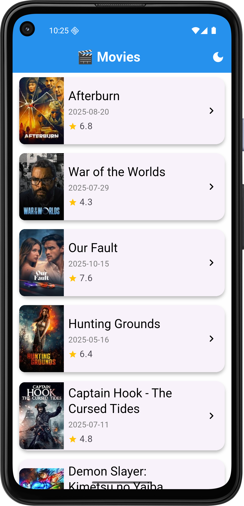
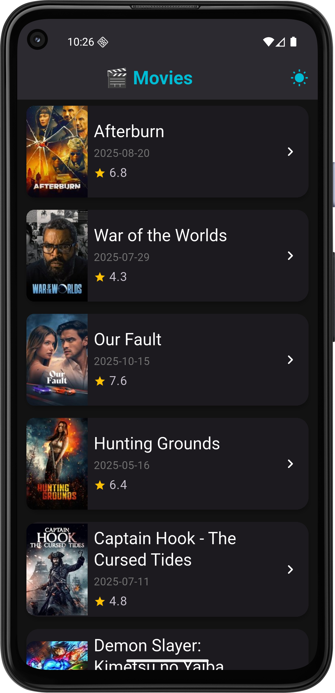
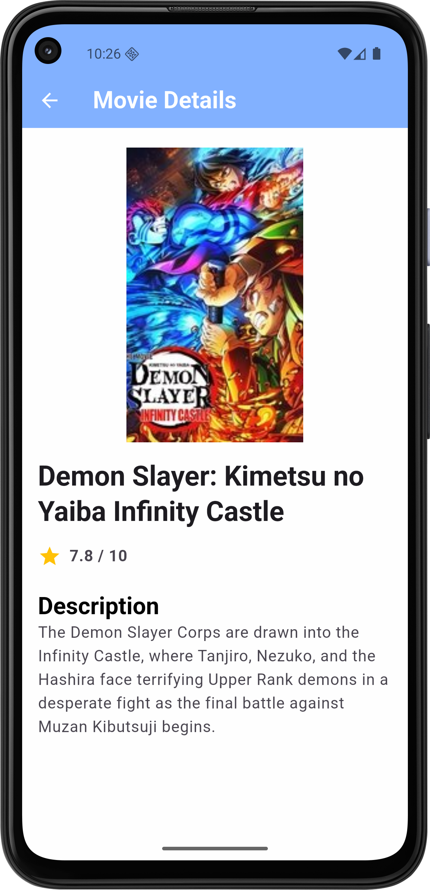
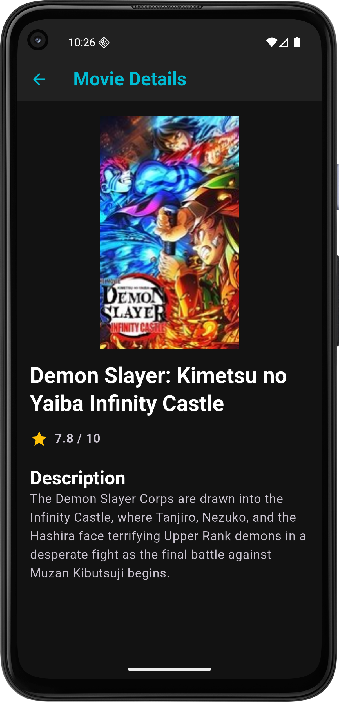

# 🎬 Movie Explorer App

A Flutter application that displays popular movies using **The Movie Database (TMDB) API**, featuring:
🌗 **Light & Dark themes**,
📜 **Pagination**,
💾 **Local caching (Hive)**, and
🐞 **Error logging (Sentry)**.

---

### 🖼️ Screenshots

|                         Light Theme                         |                        Dark Theme                         |
|:-----------------------------------------------------------:|:---------------------------------------------------------:|
|     |     |
|        :------------------------------------------:         |        :----------------------------------------:         |
|  |  |

---

### ✨ Features

#### 🌗 Theming

* Built using `ThemeCubit` (Bloc pattern).
* Supports instant toggle between **Light** and **Dark** mode.
* Custom color palettes for both modes defined in `AppTheme`.

#### 📜 Pagination

* Automatically fetches the next page of movies when scrolling to the bottom of the list.
* Handled via `MovieCubit` with Dio API requests.

#### 💾 Caching

* Movie data is stored locally using **Hive** for offline access.
* Reduces redundant API calls and improves performance.

#### 🐞 Error Logging

* Integrated **Sentry** for real-time crash and error monitoring.
* Catches unexpected exceptions from network calls and UI.

#### 🎥 Movie Details

* Tap a movie to view:

    * Poster
    * Overview
    * Vote average `/10`

---

### 🧱 Architecture Overview

```
lib/
│
├── core/
│   └── themes/
│       ├── app_theme.dart          
│       ├── dark_theme.dart        
│       └── light_theme.dart 
│   └── constant.dart
│
├── features/
│   ├── data/
│   │   ├── movie_model.dart        # Movie model
│   │   └── movie_services.dart     # API service using Dio
│   │
│   ├── presentation/
│   │   ├── movie_cubit/
│   │   │   ├── movie_cubit.dart
│   │   │   └── movie_state.dart
│   │   ├── theme_cubit/
│   │   │   └── theme_cubit.dart
│   │   └── screens/
│   │       ├── movie_list_page.dart
│   │       └── movie_details_page.dart
│
└── main.dart
```

---

### ⚙️ Setup Instructions

#### 1️⃣ Prerequisites

* Flutter SDK (3.0+ recommended)
* Dart 3+
* TMDB API Key ([Get one here](https://developer.themoviedb.org/reference/intro/authentication))

#### 2️⃣ Install dependencies

```bash
flutter pub get
```

#### 3️⃣ Add your API key

Open `movie_services.dart` and replace:

```dart
const apiKey = 'YOUR_API_KEY';
```

with your TMDB key.

#### 4️⃣ Initialize Hive

In `main.dart`, before `runApp()`:

```dart
await Hive.initFlutter();
await Hive.openBox('moviesBox');
```

#### 5️⃣ Run the app

```bash
flutter run
```

---

### 🧠 Tech Stack

| Category             | Technology                |
| -------------------- | ------------------------- |
| **Framework**        | Flutter                   |
| **State Management** | BLoC (Cubit)              |
| **Networking**       | Dio                       |
| **Caching**          | Hive                      |
| **Error Tracking**   | Sentry                    |
| **API**              | TMDB (The Movie Database) |

---

### 🧩 Future Improvements

* Add search functionality.
* Show cast and trailer in details screen.
* Implement offline mode for full browsing.

---

### 👩‍💻 Developer Notes

This project demonstrates clean architecture with BLoC and best practices for scalability.
It balances real-world functionality (API + caching + logging) with UI/UX polish (themes, cards, responsive layout).

